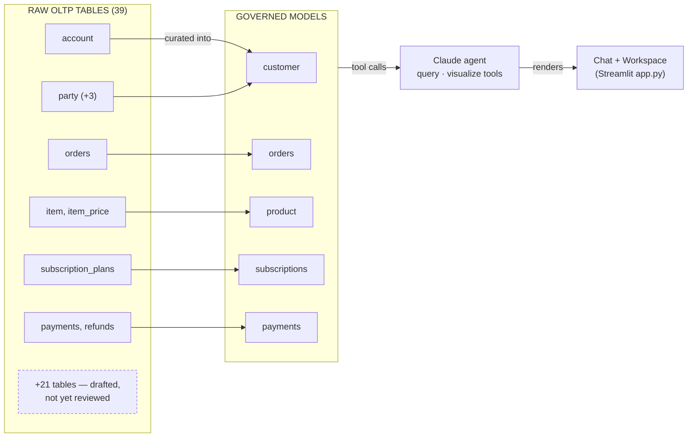

# Brightcart Decision Log

Why the data sits in DuckDB, why the agent never sees a table, and every place
a human still has to sign off before the layer trusts something new.

> A designed, illustrated version of this log is also published as a Claude
> artifact (private link, shared on request).

**Status:** 6 models governed · 21 tables drafted, awaiting review · history: Jan 2023 → present · updated 2026-09-10

Raw, fragmented OLTP tables on the left; the governed models the agent can
actually see on the right. Six of thirty-nine raw tables have been reviewed
and folded into five model families so far — the other twenty-one have
auto-drafted starting points sitting in `sample_data/models/`, waiting on a
human. Nothing crosses that boundary on its own.

---

## 01 · Platform

### DL-01 — DuckDB, not a client-server database

Both the synthetic Brightcart data and the semantic layer's query engine run
on DuckDB — a single file on disk, no server, no connection pool, embedded
directly in the same Python process as the Streamlit app and the agent's tool
calls.

The exercise was about proving what a *semantic layer* buys you on top of a
genuinely fragmented schema — not about standing up infrastructure. DuckDB
made the database a non-issue: joins across five and six satellite tables per
model stay well under a second with zero tuning, and the whole dataset
regenerates from a script in seconds. Every hour spent on infrastructure
would have been an hour not spent on the modeling this project was actually
testing.

> Sidemantic itself is engine-agnostic — Postgres, Snowflake, and BigQuery
> adapters already exist. Swapping DuckDB for a warehouse later is a
> connection-string change in `build_layer()`, not a rewrite, because nothing
> about the models themselves assumes DuckDB.

### DL-02 — The agent never sees a table, a join, or SQL it wrote itself

The agent's only interface to the data is two tools, `query_semantic_layer`
and `visualize_semantic_layer`, whose inputs are field names like
`customer.active_customer_rate` — never a table name, never a `JOIN`.
Sidemantic compiles the actual SQL.

The proof came early: asked to resolve `customer`, the layer silently
assembled `account` + `account_party` + `party` + `party_name` +
`party_contact` into one row, and the agent answered a real question over it
without ever being told those five tables existed. That gap — what the agent
can see versus what the database actually looks like — is the entire premise
of the project.

## 02 · Schema

### DL-03 — The schema is deliberately hard: hub-and-satellite, not one wide table

`generate_brightcart_fragmented.py` models `account` and `party` as bare hub
tables — an id, a status, a few dates — with every descriptive attribute
split into satellite tables joined back in, plus enum/lookup tables
(`account_status`, `party_type`, `gender`, …) shaped as `code + description`
rather than free-text columns. There is no `customers` table anywhere in the
database.

This is how mature, heavily-normalized OLTP systems actually look. A flatter
schema would have made the semantic layer's job trivial and its value harder
to see — the fragmentation had to be real for collapsing it to mean anything.

### DL-04 — Person vs. company is two satellite tables, not one nullable column 🔒

*Human in the loop*

When asked whether a customer was a person or a company, the answer wasn't a
boolean bolted onto `party` — it's `party_individual_detail` (gender, date of
birth) and `party_organization_detail` (company type, industry, employee
count band), each populated for exactly one of the two party types.

A company's attributes and a person's attributes don't share a shape —
cramming both into one table with half the columns always `NULL` would have
been the same modeling mistake the rest of the schema was built to avoid. The
design was reviewed and agreed before any code was written: which table gets
the company's name (a new `legal_name` field, not a repurposed `last_name`)
and whether data volume should scale with the longer history were both
decided by the user up front, not defaulted.

> Verified directly against the data: every one of 461 parties has **exactly
> one** of the two detail rows — never zero, never both.

## 03 · Governance

### DL-05 — A six-part vocabulary, audited against the schema on purpose

Rather than let the model grow organically, the schema was explicitly
checked against a standard semantic-layer taxonomy — entities, relationships,
dimensions, measures, metrics, and filters — and the two real gaps it found
(governed metrics, governed filters) were built to close it.

| Term | What it is | In Brightcart |
|---|---|---|
| **Entities** | The nouns of the business | `customer`, `orders`, `product`, `subscriptions`, `payments` |
| **Relationships** | How entities join, defined once | `orders → customer` via `Relationship(...)`, reused by every query |
| **Dimensions** | The ways you slice | `status_code`, `gender_code`, `order_date`, … |
| **Measures** | Raw aggregations | `customer_count`, `order_count` |
| **Metrics** | Governed business numbers | `active_customer_rate`, `net_revenue`, `mrr` |
| **Filters** | Shared definitions of a term | Segments: `active_customers`, `churned_customers`, … |

### DL-06 — Metrics are built from measures once — not recomputed per question

Sidemantic's `Metric` type supports `ratio` and `derived` definitions that
reference other measures by name, rather than every question re-deriving the
same formula from scratch. `net_revenue` is `gross_amount − refund_amount`,
defined once; `active_customer_rate` is `active_customer_count ÷
customer_count`, defined once.

This wasn't a nice-to-have — a naive query would have silently produced a
wrong number. `subscription_plans.monthly_price` stores the *per-billing-
period* price, so an annual plan's yearly price sits in a column literally
named "monthly." Summing it directly would overstate annual-plan revenue
twelvefold. The `mrr` metric normalizes annual plans to their
monthly-equivalent once, in one place, instead of trusting every future
question to remember the caveat.

> Checked against real numbers: Growth Annual plan, $490/yr → **$40.83**/mo
> normalized, exactly $490 ÷ 12, verified across every subscription on that
> plan.

### DL-07 — "Active," "churned," "individual" are named once, as Segments 🔒

*Human in the loop*

Sidemantic's `Segment` is a named, reusable `WHERE` clause —
`customer.active_customers` means `status_code = 'active'`, defined in
exactly one place in `brightcart_layer.py`. The system prompt tells the agent
to reach for a matching segment before writing its own filter.

Without this, two different questions about "active" customers could each
have the agent invent its own filter — same English word, potentially
different SQL, silently inconsistent answers. A human writes the definition
once; every future question, asked any way, gets the same one.

## 04 · Agent behavior

### DL-08 — Two tools, not one — query for numbers, visualize for pictures

`query_semantic_layer` and `visualize_semantic_layer` share the exact same
governed vocabulary and field-referencing rules; they differ only in what
they hand back. The system prompt tells the agent which one fits how the
question was phrased ("how many" vs. "show me a chart of").

Chart type selection reuses Sidemantic's own `layer.chart(...).to_vegalite()`
inference (line for a time series, bar for a category breakdown) rather than
a hand-written set of rules — one less place for the project's own judgment
to drift from the layer's.

### DL-09 — Claude doesn't know today's date unless told

Asked for revenue "this year," the agent answered for 2025 — a full year in
the past — because nothing in the system prompt ever stated the actual
current date, and a language model has no built-in clock. The fix was one
line: `f"Today's date is {date.today()}..."` in the system prompt, resolving
relative time language against a stated fact instead of a guess.

### DL-10 — The chat was never actually a conversation

Every question rebuilt the Anthropic `messages` list from scratch with just
that one question — the UI displayed prior turns, but the API call
underneath never saw them. Asking "and last year?" as a follow-up produced "I
don't have the context of what you originally asked." Fixed by persisting the
full API-format conversation, tool calls included, in
`st.session_state.api_messages` and mutating it in place across turns.

## 05 · New tables, and staying in the loop

### DL-11 — A new table drafts itself a model. It never registers itself. 🔒

*Human in the loop*

`bootstrap_new_tables.py` introspects the live database and, for any table
not already listed in `MODELED_TABLES`, writes a starting-point YAML to
`sample_data/models/` — inferred primary key, dimension types, foreign-key
relationships guessed from `_id` naming. It never wires that draft into the
running layer.

Schema introspection can guess a column's type and even a foreign key from
its name. It cannot know that "active" means `status_code = 'active'`, that
`item` + `item_descriptor` + `item_price` should collapse into one `product`
the way five other tables collapsed into `customer`, or write the description
that makes a model legible to an agent six months from now. That step stays
human, on purpose — it's the same judgment call made by hand for every model
in this log.

> The caution isn't theoretical: the auto-generated draft for `subscriptions`
> included a metric called `total_plan_id` — a naive `SUM()` over a
> numeric-looking foreign key, because nothing in raw introspection knows
> `plan_id` is an identifier, not a quantity. Exactly the kind of nonsense a
> human deletes on review.

### DL-12 — The onboarding loop, and how it was actually tested

Introspect → skip anything in `MODELED_TABLES` → draft YAML → human reviews,
rewrites, and merges → folds into `build_layer()` → adds the table names to
`MODELED_TABLES`. Re-running the script afterward no longer flags it.

Verified twice against real behavior, not just read: re-running left all 26
existing drafts untouched rather than overwriting in-progress edits, and a
brand-new table added live to the database — with two foreign keys — was the
*only* thing flagged on the next run, both relationships inferred correctly.

## 06 · Exploration

### DL-13 — Self-service exploration still goes through the layer, not a spreadsheet of the answer 🔒

*Human in the loop*

The alternative on the table was PyGWalker — a genuine, Tableau-like
drag-and-drop library — seeded with a snapshot of a query result. It was
rejected. Every field in the "Explore this data" panel is pulled live from
the same catalog the agent uses, and every run still calls `compile_sql` /
`run_query` / `build_chart`.

The moment exploration operates on a frozen dataframe instead of the governed
layer, segments and governed metrics stop being enforced — a user could drag
together a "revenue" figure that quietly skips the refund normalization
`net_revenue` exists to guarantee. Governance had to survive contact with
self-service, or nothing upstream of it mattered.

### DL-14 — A rerun shouldn't erase what you just built

The first version of the panel broke on first use: Streamlit reruns the
entire script on *any* widget interaction, and only the final answer text was
ever saved across reruns — the status box, the SQL, and the Explore button
itself vanished the instant a dropdown was touched.

Fixed by recording every turn as a list of replayable blocks (interpretation
text, query result, chart) and redrawing all of them, every rerun — keyed by
Claude's own stable tool-call id rather than a position-dependent key, so the
identical widget survives both the live render and every later replay
instead of Streamlit treating it as new and discarding its state.

## 07 · Data & repository

### DL-15 — History starts January 2023, and volume grows with it

The dataset was extended from a rolling two-year window to a fixed start
date of `2023-01-01`. Because that roughly doubles the time span,
account/order/subscription volume scales by the same `HISTORY_SCALE` ratio
rather than staying flat — a longer window with the same 250 accounts would
have thinned every monthly chart instead of making the trend data more
useful.

### DL-16 — The database is generated, not committed

The ~39MB DuckDB file is gitignored; what's committed is the seeded generator
(`Faker.seed(42)`, `random.seed(42)`) that produces it deterministically.
It's a build artifact, not source — regenerating it is one command, and the
repository stays free of a large binary that would only drift from the
script that actually defines the data.

---

*Brightcart Analyst · [github.com/bigshyne/agentic_analytics](https://github.com/bigshyne/agentic_analytics) · `sample_data/`*
